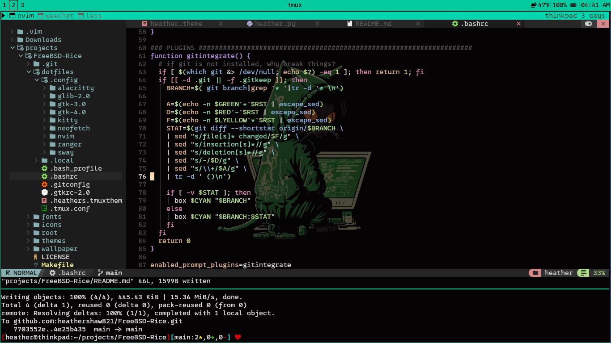

# FreeBSD-Rice

**FreeBSD-Rice** is Heather's personal collection of themes and configuration files for a beautifully customized desktop environment. It includes configurations for tools like **SwayWM**, **Bash**, **Neovim**, and more. Install everything quickly and easily using `make`.




## Features

- **Custom Themes**: Aesthetic and functional themes tailored for a cohesive desktop experience.
- **SwayWM Configurations**: Dynamic tiling window manager setup for Wayland.
- **Bash**: Enhanced shell environment with custom aliases and functions.
- **Neovim**: Tweaked for productivity and elegance.
- **Neofetch**: Personalized system information display.
- **Streamlined Setup**: Quickly install and configure everything with `make`.

## Prerequisites

- A FreeBSD installation.
- `git` and `make` installed on your system.

## Installation

Clone the repository and run `make` to set up your environment:

```bash
git clone https://github.com/yourusername/FreeBSD-Rice.git
cd FreeBSD-Rice
make
```

This will install all necessary configurations and themes automatically.

## Customization

Feel free to modify the files in this repository to suit your preferences. Each configuration file is well-commented to help you tweak settings as needed.

## License

This project is Heather's personal setup and shared as-is. Feel free to use and adapt it, but give credit where due!

